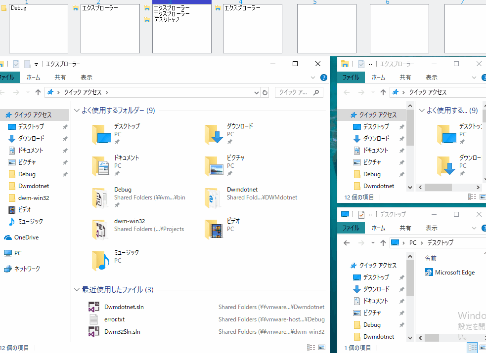

Tiling window manager written in C# / F#.

# Glossary

- Master client
  Left side window.

- Slave client
   Right side small size windows.

- Tag
  Client group name. Called virtual desktop in other application.

# How to use

- Ctrl + [1..9]
  Switch tag.

- Ctrl + Shift + [1..9]
  Send active client to arbitrary tag.

- Ctrl + Shift + M
  Change active window into master client.
  Master client will send to slave position.

- Ctrl + H
  Make tiled window manager hidden.

- Click tiled window manager list
  Switch tag and make client active.

- Click quit.
  Shut down application.

